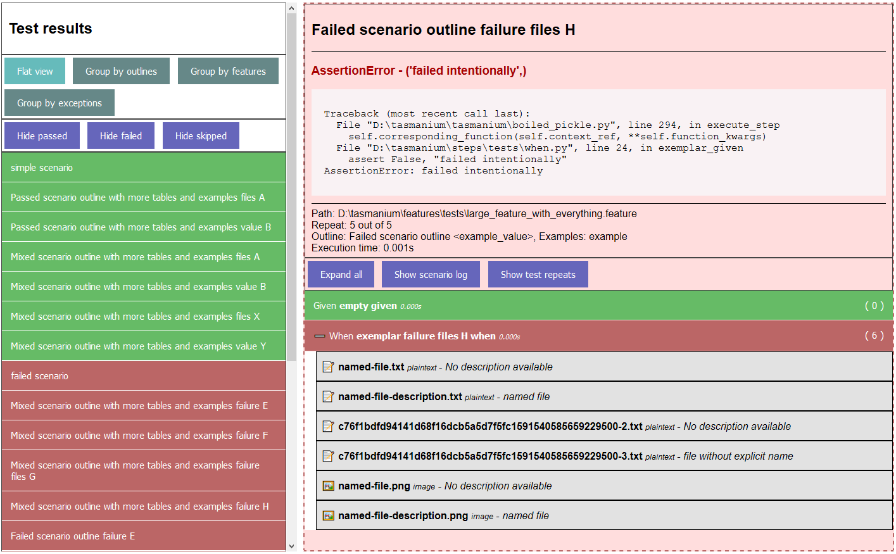

# tasmanium

I wanted to write a simple BDD testing framework by myself, so I did. Inspired by `behave` and written in Python 3.8. 

It also contains a HTML test reporter using `cheetah3` template engine.

## Features
- Feature-level parallelism
- HTML test results reporter
- Execute features by path
- Filter features by tag (all/feature/scenario/example) by tag expressions `@working and not @skippped`
- Basic retry-test-on-failure functionality
- Attach files to steps
- Docstring parser
- Paranoid logging included

## Usability
You can write and execute tests just fine, but a lot of quality-of-life stuff are WIP or not implemented at all.
Test coverage is... sub-optimal at this time. Expect some bugs.

I wrote this just for fun/to gain some XP, and I'm not planning to work on this in a foreseeable future.

## Usage

- feature files are in `features/`, subdirectories supported
- step implementations are in `steps`, must be a python module. subdirectories (submodules) supported
- when running tests, you can provide multiple paths into `feature/`, this can be used for simple test filtering
- more complex filtering can be done using gherkin tags and tag expressions like `(not @broken and not @wip) and @production`



#### Examples

- `python main.py run subfolder/test.feature` will run this specific feature file
- `python main.py run --tags 'not @broken' -p 4` will skip any feature files tagged with `@broken` tag, and will run features 4 at a time
- `python main.py run --scenario-tags 'not @wip' --failed-repeat-count 1` will skip any **scenarios** marked with `@wip` tag and will repeat tests (scenarios) if they fail
- add `--html-report` to generate a HTML report
- `python main.py show-html` will start a local server serving the HTML report

For test and step examples, check feature files in `features/tests/` and steps in `steps/tests/`.
The actual "unit" tests using these are in `tasmaium/tests/`.


```
python main.py --help
Usage: main.py [OPTIONS] [run|show-html] [FEATURE_PATHS]...

  Tasmanium - a simple BDD framework.

Options:
  --tags TEXT                     Filter tests by tags using a tag expression.
                                  [default: ]
  --feature-tags TEXT             Filter tests by feature tags.  [default: ]
  --scenario-tags TEXT            Filter tests by scenario/scenario outline
                                  tags.  [default: ]
  --example-tags TEXT             Filter tests by tags of example tables.
                                  [default: ]
  --parallel INTEGER RANGE        Execute features in parallel.  [default: 1]
  --log-level [CRITICAL|ERROR|WARNING|INFO|DEBUG|TRACE|TTRACE]
                                  Set log level.
  --failed-repeat-count INTEGER   Repeat tests N times upon failure.
                                  [default: 0]
  --html-report / --no-html-report
                                  Generate a HTML report.
  --port INTEGER                  show-html: Run HTML report server on this
                                  port.  [default: 6789]
  --help                          Show this message and exit.
```

## Testing
There are some `unittest` tests (more coverage required) and some E2E tests (for HTML reporter) in `tasmanium/tests/`. 
For E2E, a remote selenium server is expected to be running.

The E2E test(s) click on nearly everything, so they might take a while to finish.

## Issues
- Implement the TODO methods in `Context`.
- Importing of step submodules started importing nonexistent stuff sometimes.
- Python - do not keep attachments in memory.
- HTML reporter - do not keep attachments in memory.
- HTML reporter - improve JS performance on large test suites.
- Fix `Must provide filename for images` error in `attach_image`.

## Worthy mentions
This project is using a modified version of https://github.com/cucumber/gherkin-python v9.0.0 licensed under [MIT license](tasmanium/gherkin/LICENSE.txt).